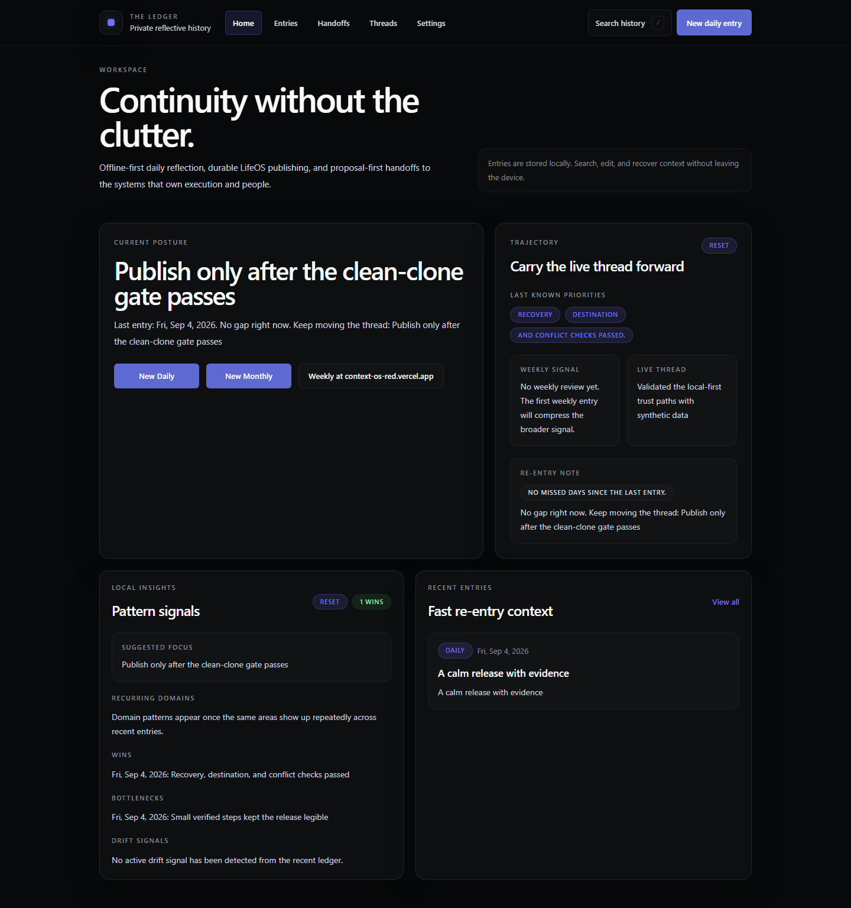

# The Ledger

The Ledger is a private, offline-first journal for daily entries and monthly reviews. It keeps drafts and history in the browser, publishes durable Markdown to LifeOS, and sends editable proposals to an explicitly approved ContextOS or SocialOS origin only after showing the exact host.

> **Local-first, not encrypted:** journal data stays in this browser profile and
> is not sent to this repository or an application backend. Anyone with access
> to the browser profile may be able to read it. Export a backup before clearing
> site data, changing profiles, or moving devices.



The [mobile view](./docs/assets/the-ledger-mobile.png) and [recovery controls](./docs/assets/the-ledger-recovery.png) are also captured with synthetic-only data.

## Current product scope

- Versioned daily and monthly prompts with an optional freeform reflection
- Historical weekly entries retained read-only; new weekly reviews open ContextOS `/reviews`
- Local-calendar dates, one canonical entry per day/month, and explicit legacy duplicates
- Seven LifeOS area tags plus the operational `life-admin` tag
- Debounced draft autosave with a synchronous navigation/exit flush; autosave-off
  navigation requires an explicit Save or Discard choice
- JSON backup schema v2 with v1 import compatibility, strict validation, and a
  verified local recovery snapshot before import replacement
- Recovery downloads for corrupt raw storage and reversible import/restore state
- Cross-tab conflict freezing and visible browser-quota warnings
- LifeOS publishing through a connected folder or Markdown/ZIP downloads
- Managed Markdown regions that preserve user and agent additions on republish
- Proposal-first `lifeos-handoff/v1` links restricted to HTTPS origins (loopback
  HTTP is allowed for development) with no path, query, credentials, or fragment

## Ownership boundaries

- The Ledger authors daily journals and monthly reviews.
- LifeOS owns their durable Markdown canon.
- ContextOS owns weekly reviews, tasks, execution, and proposal triage.
- SocialOS owns people-specific records.
- Folder handles stay in IndexedDB and are never included in Ledger backups.

## Stack and verification

React 18, TypeScript, Vite 8, Tailwind CSS, local browser storage, Vitest 4,
Playwright, and `vite-plugin-pwa`. The supported runtime is Node 20.19–20.x with
npm and the committed lockfile.

```powershell
npm ci
npm run check
npx playwright install chromium
npm run test:e2e
```

`npm run check` runs lint, unit/component tests, the production PWA build, and
both production and full-tree dependency audits. CI repeats those checks from a
clean install and runs the Chromium trust-path suite at 320, 390, and desktop
widths.

## Recovery and handoffs

- Settings → **Recovery** lists preserved raw snapshots. Download first when a
  corrupt snapshot cannot be restored automatically.
- If recovery storage itself is unavailable, writes stay frozen and the active
  raw value remains untouched; **Start fresh** unlocks only after that value is
  downloaded.
- An import that changes ContextOS or SocialOS shows both old and incoming hosts
  and cannot proceed until the change is explicitly confirmed.
- A storage change from another tab freezes writes. Export the current tab if
  needed, then reload to accept the other tab's state.
- Handoff content is carried in a URL fragment. The app validates the origin and
  asks again before opening the exact destination host, but the receiving app is
  still a separate trust boundary.

See [Project State](./docs/PROJECT_STATE.md), [Architecture](./docs/architecture.md), [Repo Map](./docs/REPO_MAP.md), [Run Protocol](./docs/RUN_PROTOCOL.md), [Security](./SECURITY.md), and [Design](./docs/DESIGN.md).
